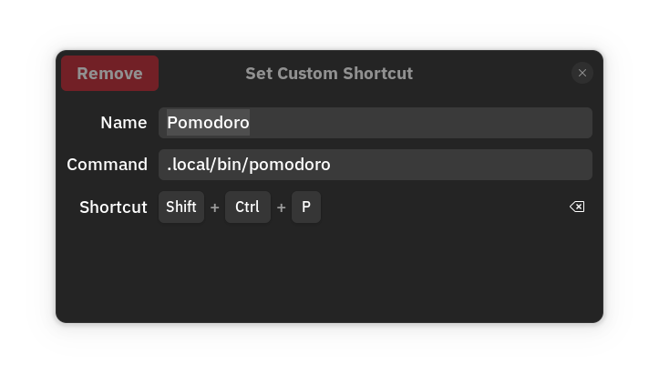

# Pomodoro script

<br><br>

1. Install `zenity` if not already installed:
```bash
sudo dnf install zenity
```

2. Save this script as file and name it `pomodoro`:
```bash
#!/bin/bash

session_count=0

while true; do
  # Increment session count
  session_count=$((session_count + 1))

  # Work session of 25 minutes (1500 seconds)
  if zenity --question --title="Work Session $session_count" --text="Ready to work for 25 minutes?"; then
    (
      for ((i=0; i<=1500; i++)); do
        echo $(( i * 100 / 1500 ))
        sleep 1
      done
    ) | zenity --progress --title="Working Session $session_count" --text="Working for 25 minutes" --percentage=0 --auto-close
  else
    break  # Exit the loop if user cancels
  fi

  # Notify break based on session count
  if (( session_count % 4 == 0 )); then
    # Long break after 4 sessions (15 minutes = 900 seconds)
    if zenity --question --title="Long Break" --text="Session $session_count complete. Time for a long break (15 minutes)?"; then
      (
        for ((i=0; i<=900; i++)); do
          echo $(( i * 100 / 900 ))
          sleep 1
        done
      ) | zenity --progress --title="Long Break" --text="Relax for 15 minutes" --percentage=0 --auto-close
    else
      break  # Exit if user cancels
    fi
  else
    # Short break after each work session (5 minutes = 300 seconds)
    if zenity --question --title="Short Break" --text="Session $session_count complete. Time for a short break (5 minutes)?"; then
      (
        for ((i=0; i<=300; i++)); do
          echo $(( i * 100 / 300 ))
          sleep 1
        done
      ) | zenity --progress --title="Short Break" --text="Relax for 5 minutes" --percentage=0 --auto-close
    else
      break  # Exit if user cancels
    fi
  fi

  # Confirmation to start the next session
  if ! zenity --question --title="Next Session" --text="Ready for the next session?"; then
    break  # Exit if user cancels
  fi
done
```

3. Save the script to a file, e.g., break_reminder.sh, and give it executable permission:
```bash
chmod +x pomodoro.sh
```

4. Move this script to this location `~/.local/bin` so you can execute pomodoro from terminal to run the script:
``` bash
mv pomodoro ~/.local/bin
```

5. Make keyborad shortcut to start pomodoro without terminal go to `Settings > Keyboard > Keyboard Shortcuts > Custom Shortcut` and type the command as shown and set the shortcut as you like:
